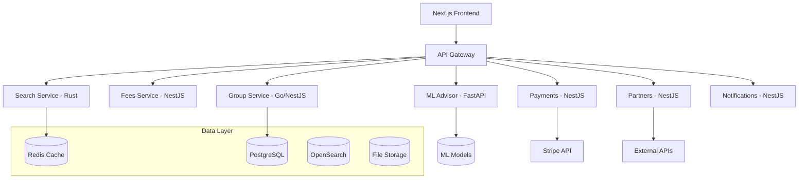

# SkyScout AI - Everyone Travel Architecture

## Overview

SkyScout AI is evolving into a comprehensive "Everyone Travel" platform focused on:

- **Group Planning**: Collaborative trip planning with governance and decision-making
- **Multi-Modal Transport**: Flights, trains, buses, car rental, RV, camping support
- **Consumer Trust**: Transparent pricing, intelligent advisors, and clear value propositions

## System Architecture

### Core Services



### Feature Modules

#### A) Consumer Core Features

**1. Flight Matchmaking (Top-3)**

- **Service**: Search Service (Rust)
- **Logic**: Multi-criteria ranking (price, time, stops, comfort)
- **Output**: Top 3 results with trade-off explanations
- **Files**: `apps/search-rs/src/ranker.rs`, `apps/web/src/components/search/TopThree.tsx`

**2. True Total Cost**

- **Service**: Fees Service (NestJS)
- **Logic**: Line-item breakdown across all transport modes
- **Integration**: Supports flights, trains, buses, car, RV, camping
- **Files**: `apps/fees/src/main.ts`, `apps/web/src/components/cost/TotalTripCost.tsx`

**3. Price-Confidence Booking Advisor**

- **Service**: ML Advisor (FastAPI)
- **Logic**: ML-based price prediction with confidence scoring
- **Output**: "Book now" vs "Wait" recommendations
- **Files**: `apps/api-ml/app/price_advisor.py`, `apps/web/src/components/advisor/PriceAdvisor.tsx`

**4. Price Tracking & Alerts**

- **Service**: Notifications Service (NestJS)
- **Logic**: Route/date watchlists with threshold monitoring
- **Features**: Daily digests, instant alerts, historical tracking
- **Files**: `apps/notifications/src/price_watch.processor.ts`, `apps/web/src/components/alerts/`

**5. Persistent Personalization**

- **Storage**: User preferences in PostgreSQL
- **Auto-application**: Preferences applied to every search
- **Scope**: Cabin class, layover limits, carrier preferences, loyalty programs
- **Files**: `apps/web/src/app/settings/preferences/page.tsx`

**6. Unified Itinerary**

- **Service**: Group Service + Frontend
- **Features**: Transport + accommodation + activities timeline
- **Exports**: ICS calendar, PDF trip pack
- **Files**: `apps/web/src/app/itinerary/[tripId]/page.tsx`

#### B) Group Planning Features

**Trip Workspace Architecture**

- **Role-based Access**: Owner, Editor, Viewer permissions
- **Tabs**: Overview, Proposals, Polls, Availability, Itinerary, Lodging/Rooms, Expenses, Payments, Governance, Messages
- **Real-time**: WebSocket updates for collaborative editing

**Governance Engine**

```typescript
interface Charter {
  votingMethod: 'approval' | 'ranked' | 'score';
  consensusThreshold: number; // 0-100%
  quorum: number; // minimum voters
  vetoWindowHours: number; // time to object
  multisigPolicy: Record<string, number>; // role -> approval count needed
}
```

**Decision Flow**

1. **Proposal**: Member creates proposal (dates, destination, etc.)
2. **Voting**: Members vote based on charter rules
3. **Consensus**: System calculates if threshold met
4. **Soft Lock**: Proposal locked, veto window opens
5. **Veto Period**: Members can object within time window
6. **Multisig**: Required approvals for final lock
7. **Hard Lock**: Proposal finalized and immutable

#### C) Multi-Modal Transport

**Supported Transport Types**

- Flights (primary)
- Trains (regional/international rail)
- Buses (intercity, charter)
- Car Rental (standard rental companies)
- RV Rental (motorhomes, travel trailers)
- Camping (campgrounds, RV parks)

**Partner Adapter Pattern**

```typescript
interface TransportAdapter {
  search(criteria: SearchCriteria): Promise<TransportResult[]>;
  getDetails(id: string): Promise<TransportDetails>;
  checkAvailability(id: string, dates: DateRange): Promise<boolean>;
  book(booking: BookingRequest): Promise<BookingConfirmation>;
}
```

**Routing Comparison Engine**

- Time vs Cost vs Comfort matrix
- Multi-modal journey planning
- Environmental impact scoring
- Accessibility feature filtering

#### D) Monetization & Bundles

**Revenue Streams**

1. **Service Fees**: 2-6% per trip with transparent cap
2. **Premium Subscriptions**: Advanced features, analytics
3. **Partner Commissions**: Hotels, activities, insurance
4. **Enterprise Licenses**: Organizations, clubs, companies

**Bundles Engine**

- Post-selection suggestions
- ML-powered recommendations
- Partner API integrations
- Revenue optimization algorithms

## Data Models

### Core Entities

**Trip**

```typescript
interface Trip {
  id: string;
  name: string;
  destinations: string[];
  startDate: Date;
  endDate: Date;
  participants: Participant[];
  charter: Charter;
  proposals: Proposal[];
  commitments: Commitment[];
  expenses: Expense[];
  status: 'planning' | 'active' | 'completed' | 'cancelled';
}
```

**Proposal**

```typescript
interface Proposal {
  id: string;
  tripId: string;
  type:
    | 'dates'
    | 'destination'
    | 'flight'
    | 'lodging'
    | 'activity'
    | 'budget'
    | 'transport';
  title: string;
  data: any; // Type-specific proposal data
  status: 'open' | 'soft_locked' | 'hard_locked' | 'archived';
  deadline?: Date;
  votes: Vote[];
  consensus?: Consensus;
  version: number;
  createdBy: string;
  createdAt: Date;
}
```

**Commitment**

```typescript
interface Commitment {
  id: string;
  tripId: string;
  userId: string;
  status: 'committed' | 'pending_payment' | 'paid' | 'refunded' | 'dropped';
  shareAmountCents: number;
  paymentIntentId?: string;
  paidAt?: Date;
  refundedAt?: Date;
}
```

### Performance Targets

- **Search Response**: <500ms p95 for filter changes
- **Page Load**: <2s initial load
- **API Response**: <200ms internal calls (cached)
- **Real-time Updates**: <100ms WebSocket latency
- **Database Queries**: <50ms p95 for core queries

## Security & Compliance

### Data Protection

- **PII Encryption**: At rest and in transit
- **Access Control**: Role-based permissions per trip
- **Audit Logging**: Full change history and approval trails
- **Rate Limiting**: API and user action throttling

### Financial Security

- **Payment Processing**: PCI DSS compliant via Stripe
- **Idempotency Keys**: Prevent duplicate charges
- **Multisig Approvals**: Financial decision governance
- **Fraud Detection**: ML-based anomaly detection

### Accessibility & Ethics

- **WCAG 2.1 AA**: Full compliance
- **Inclusive Language**: Neutral examples, diverse representation
- **Transparent Pricing**: No hidden fees or dark patterns
- **Safe Content**: No alcohol/unsafe behavior promotion

## Deployment & Operations

### Infrastructure

- **Kubernetes**: Container orchestration
- **Service Mesh**: Istio for inter-service communication
- **Observability**: OpenTelemetry, Jaeger, Prometheus
- **Feature Flags**: LaunchDarkly for controlled rollouts

### CI/CD Pipeline

1. **Code Review**: Automated testing and security scans
2. **Staging**: Full integration testing environment
3. **Canary Deployment**: Gradual production rollout
4. **Monitoring**: Real-time performance and error tracking

### Monitoring & Alerting

- **Application Metrics**: Response times, error rates, throughput
- **Business Metrics**: Conversion rates, revenue, user engagement
- **Infrastructure Metrics**: Resource utilization, costs
- **User Experience**: Core Web Vitals, accessibility scores

## Development Roadmap

### Phase 1: Consumer Core (M1)

- Flight matchmaking and top-3 ranking
- True total cost calculator
- Price advisor baseline
- Basic personalization

### Phase 2: Group Foundation (M2)

- Trip workspace and governance
- Proposal and voting system
- Basic payment splitting
- Real-time collaboration

### Phase 3: Multi-Modal (M3)

- Train and bus integration
- Car rental partnerships
- RV and camping support
- Routing comparison engine

### Phase 4: Advanced Features (M4)

- ML-powered recommendations
- Advanced analytics
- Enterprise features
- Mobile applications

This architecture provides the foundation for building SkyScout AI into a comprehensive travel platform that serves individuals and groups across all transport modes while maintaining transparency, security, and user trust.
